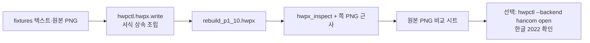

# HWPX 업그레이드 계획 — 한글 없이 조립하기

조사 결론([research-hwp-without-hangul.md](research-hwp-without-hangul.md))을
따른다. **1차 엔진은 `python-hwpx`**, `hwpctl` COM 은 **선택적 실물 확인**이다.

검증한 패키지: **`python-hwpx` 6.3.0** (PyPI, Apache-2.0, Python ≥3.10, 의존성 `lxml`).
6.x 고수준 이름(`HwpxDocument.open` / `new` / `add_paragraph` / `add_table` /
`styles.ensure_run` / `save_to_path(..., mode="patch")`)을 쓴다.
7.0에서 5.x 호환 shim 이 제거될 수 있어 extra 는 `python-hwpx>=6.3,<7` 로 묶는다.
`python-hwpx-automation` 은 양식 채움·별도 MCP 용이며 **지금은 넣지 않는다**.



## 현재 상태 (이 PR)

- extra `hwpx`: `pip install -e ".[hwpx]"` — Linux CI 에서 한/글·pywin32 없이 설치.
- `--backend auto|hwpx|hancom` — `auto` 는 Windows 가 아니면 `hwpx`.
- `hwpctl/hwpx/write.py` — 문단, 부분 런(색·밑줄), 표 채움/테두리/열너비,
  크림 구역 헤더, 쪽 설정.
- `scripts/recreate_gongo.py` — 공고문 1–10·27–29쪽 조립. **1–3쪽 충실**,
  나머지 골격.
- `hwpx_compare` — inspect JSON + `python-hwpx` 레이아웃 HTML + Pillow 근사 PNG
  + 원본 PNG 나란히 비교. 한/글 래스터·LibreOffice `hwpfilter` 없음.
- 기존 `hangul.py` / Engine COM 명령은 그대로. 한글 2024 GSG 없음.

Linux 에서 재현:

```bash
pip install -e ".[hwpx]"
hwpctl --backend auto hwpx_status
python scripts/recreate_gongo.py --out artifacts/gongo
hwpctl hwpx_inspect artifacts/gongo/rebuild_p1_10.hwpx
hwpctl hwpx_compare artifacts/gongo/rebuild_p1_10.hwpx \
  --orig-dir fixtures/gongo --out-dir artifacts/gongo
pytest
```

바이너리 `fixtures/gongo/doc1.hwp` → `.hwpx` 변환은 이 환경에서 검증된
변환기를 쓰지 않았다. `gongo_pages.json` 과 `orig_p1.png`–`orig_p3.png` 로
처음부터 조립한다.

## 1단계 — 준비 (완료, 이전 PR)

- 패키지 `hwpctl/hwpx/`: `document` · `inspect` · `write` · `compare`.
- 읽기 명령 `hwpx_status` / `hwpx_inspect` — **COM·SingleWriterLock 없음**.

## 2단계 — 원본 검사 (부분 완료)

원본은 `.hwp` 라 `hwpx_inspect` 로 열 수 없다. 쪽 텍스트 JSON 과 1–3쪽
스크린샷으로 글꼴(함초롬돋움/바탕), 정렬, 크림 채움, 빨간 기한 밑줄,
파란 URL 밑줄을 고정한 뒤 그 값을 **상속**해 썼다.

## 3단계 — 조립 (이 PR)

`insert_paragraph` / `insert_runs` / `create_table_and_fill` /
`cream_section_header` / `boxed_block` 으로 초안을 만들고 `save_document` 로
저장한다. `add_shape` / `add_control` 은 쓰지 않는다.

| 쪽 | 상태 |
|---|---|
| 1 | 제목·양쪽 정렬 서문·우측 일자/이사장·크림 간단소개·Q1–Q6·빨간 기한 밑줄 |
| 2 | 크림 `1 사업개요`·□ 항목·빨간 기한·파란 URL·STEP 표 |
| 3 | 크림 `2 지원대상`·신청자격 부분 굵게·신청제외 상자·밑줄 주의 |
| 4–10, 27–29 | 크림 헤더 + JSON 본문 골격. 표·도식 세부는 다음 |

## 4단계 — 시각 비교 (이 PR, 한/글 없음)

`compare.py` 가 쪽 PNG 근사와 원본 스크린샷을 붙인다.
한/글이 그린 화면이 아니며, 글꼴은 Linux 의 Noto CJK 로 대체한다.
셀 안 여러 문단·정확한 줄바꿈·오른쪽 빗금 장식은 근사이다.

## 5단계 — 선택적 `hwpctl open` (사용자 PC, 다음)

Windows + 한글 2022 가 있을 때만 `hwpctl --backend hancom open` 으로
실물 창에서 확인·미세 조정한다. 자동저장 동작은 바꾸지 않는다.
한글 2024 GSG API 는 쓰지 않는다.

## 하지 않는 것

- COM 경로 재작성, `hangul.py` 삭제
- `.hwp` 바이너리 쓰기
- LibreOffice `hwpfilter` 변환
- `python-hwpx` 포크/벤더링
- 한글 2024 GSG
